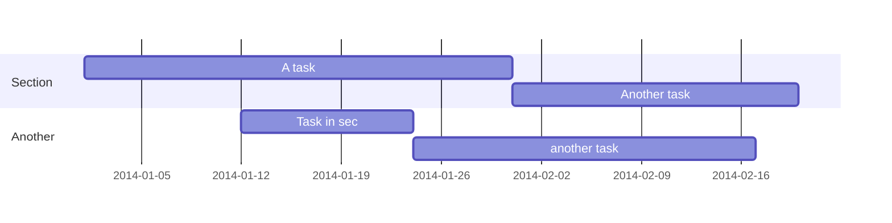

---
# Display name
title: Adrián Arnaiz-Rodríguez

# Is this the primary user of the site?
superuser: true

# Role/position/tagline
role: Artificial Intelligence Researcher

# Organizations/Affiliations to show in About widget
organizations:
- name: Burgos University
  url: https://www.ubu.es/

# Short bio (displayed in user profile at end of posts)
bio: Ai researcher @ UBU -- ML/DL/RL/NS enthusiast and its intersection with Medicine.

# Interests to show in About widget
interests:
- Artificial Intelligence
- Machine Learning
- Deep Learning
- Reinforcement Learning
- Network Science
- Geometric Learning (GNN)

# Education to show in About widget
education:
  courses:
  - course: MSc in Data Science and Artificial Intelligence
    institution: Open University of Catalonia (Universitat Oberta de Catalunya)
    year: 2021
  - course: BSc in Computer Science
    institution: Burgos University
    year: 2019

# Social/Academic Networking
# For available icons, see: https://sourcethemes.com/academic/docs/page-builder/#icons
#   For an email link, use "fas" icon pack, "envelope" icon, and a link in the
#   form "mailto:your-email@example.com" or "/#contact" for contact widget.
social:
- icon: envelope
  icon_pack: fas
  link: '/#contact'
- icon: twitter
  icon_pack: fab
  link: https://twitter.com/arnaiztech
- icon: orcid 
  icon_pack: ai
  link: https://orcid.org/0000-0001-5567-801X
- icon: google-scholar  # Alternatively, use `google-scholar` icon from `ai` icon pack
  icon_pack: ai
  link: https://orcid.org/0000-0001-5567-801X
- icon: github
  icon_pack: fab
  link: https://github.com/AdrianArnaiz
- icon: linkedin
  icon_pack: fab
  link: https://www.linkedin.com/in/adrian-arnaiz-rodriguez/?locale=en_US
  

# Link to a PDF of your resume/CV.
# To use: copy your resume to `static/media/resume.pdf`, enable `ai` icons in `params.toml`, 
# and uncomment the lines below.
- icon: cv
  icon_pack: ai
  link: media/resume.pdf

# Enter email to display Gravatar (if Gravatar enabled in Config)
email: ""

# Highlight the author in author lists? (true/false)
highlight_name: false
---

Adrián Arnaiz interests and short bio - TBD

Lorem ipsum dolor sit amet, consectetur adipiscing elit. Sed neque elit, tristique placerat feugiat ac, facilisis vitae arcu. Proin eget egestas augue. Praesent ut sem nec arcu pellentesque aliquet. Duis dapibus diam vel metus tempus vulputate.

 Download my resumé.

