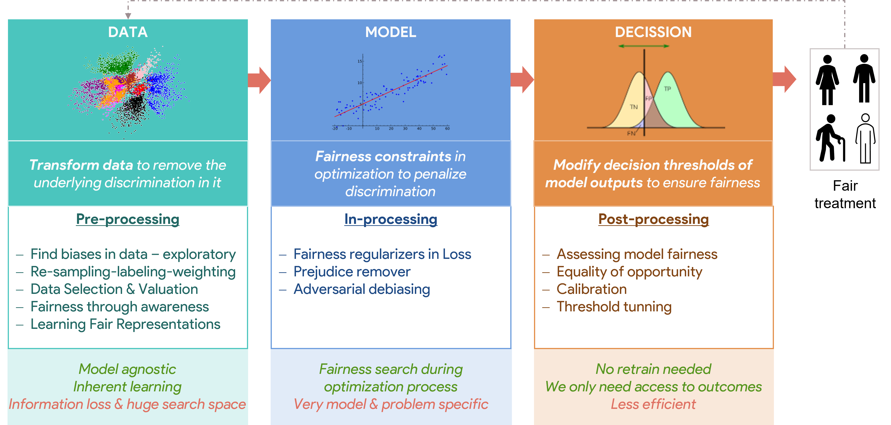

Long Talk after 2 months of PhD. The talk in focused on giving a long introduction to the sociotechnical problem of Algorithmic Fairness in Decision Making. This-90 slides presentaion covers broadly the motivation, previous approaches, current approaches and open challenges of the field. In addition, it also cover some sociological and historical concerns about this field, wich is obvoiusly interdisciplinary given the deep importance that it has in ethical and sociological problems.

