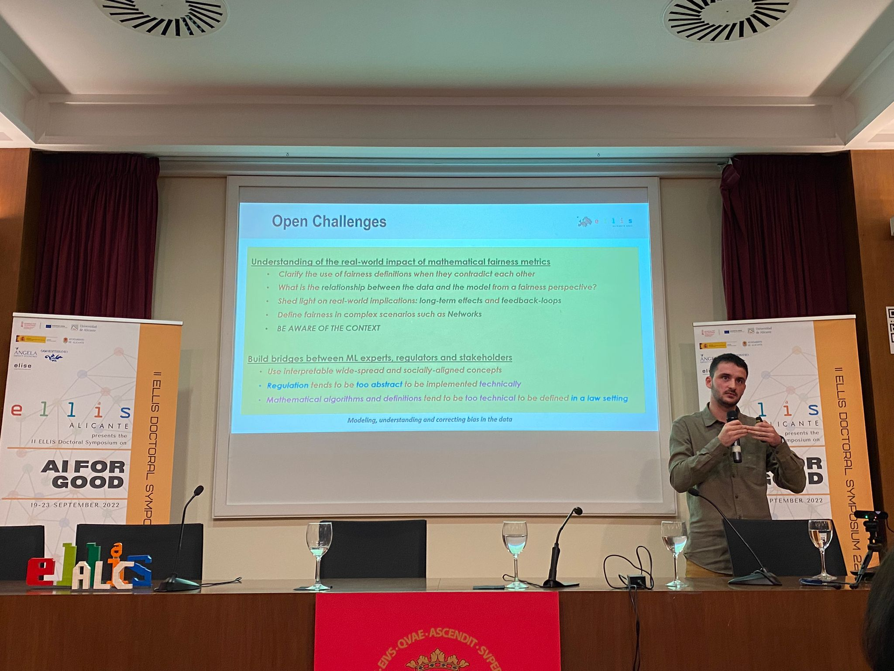
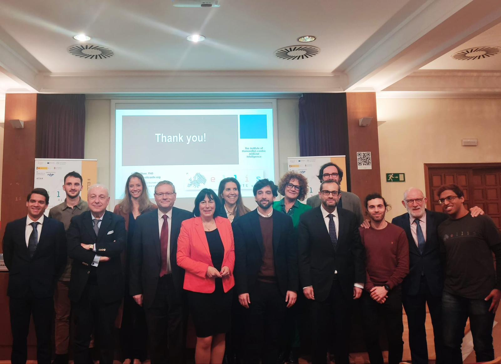

* Press Articles: [todoAlicante](https://www.todoalicante.es/sociedad/parlamento-europeo-ellis-alicante-inteligencia-artificial-20230227113001-nt.html), [INFORMACION](https://www.informacion.es/alicante/2023/02/25/europa-cuenta-ellis-alicante-ua-83482677.html).

**Europarlamentarians** (MEPs, [@EP_Legal](https://twitter.com/EP_Legal)):
* Adrián Vazquez Lázara (SP, [@AdrianVL1982](https://twitter.com/AdrianVL1982))
* Marion Walsmann (GE, [@MarionWalsmann](https://twitter.com/MarionWalsmann))
* Ibán García Del Blanco (SP, [@Ibangarciadb](https://twitter.com/Ibangarciadb))
* Gilles Lebreton (FR, [@Gilles_Lebreton](https://twitter.com/Gilles_Lebreton))
* Alessandra Basso (IT, [@alebassoMEP](https://twitter.com/alebassoMEP))
* Raffaele Stancanelli (IT, [@r_stancanelli](https://twitter.com/r_stancanelli))

 