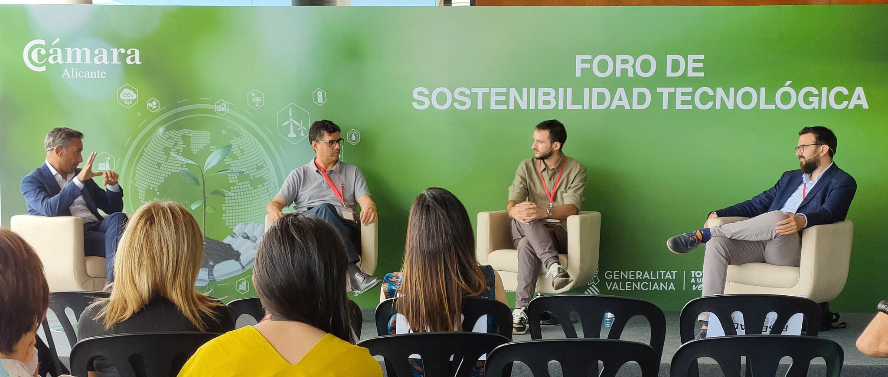
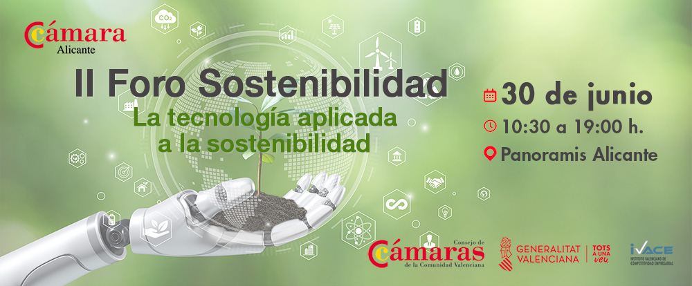

The **2nd Forum of Sustainable Technology** organized by [Chamber of Commerce of Alicante](https://www.camaralicante.com/) is a 9h event where different experts on technology, law, economy and sustainability will give talks and participate in rounds tables to shed light on the role of technology for a sustainable development in the society.

I participate in the following 1h-Round Table ([Video](https://vimeo.com/carlospujalte/review/857398631/cb40cbf54c)): 

**How does the Application of Artificial Intelligence help us to be sustainable?**
* **Adrián Arnaiz Rodríguez** - *PhD Student at ELLIS Alicante on Human-Centric Machine Learning and Algorithmic Fairness*
* **Jose Fuster** - *Director of European Funds and Sustainability of Bank Sabadell*
* **Antonio Sánchez** - *President of [AlicanTec](https://alicantec.com/)*

The event is aimed at professionals, companies and future entrepreneurs from different sectors of activity.

***This conference is part of the Sustainability and Agenda 2030 Program, financed by the IVACE (Valencian Institute of Business Competitiveness), which, through the Alicante Chamber of Commerce, promotes a series of actions to help implement sustainability in companies of all economic sectors.***
