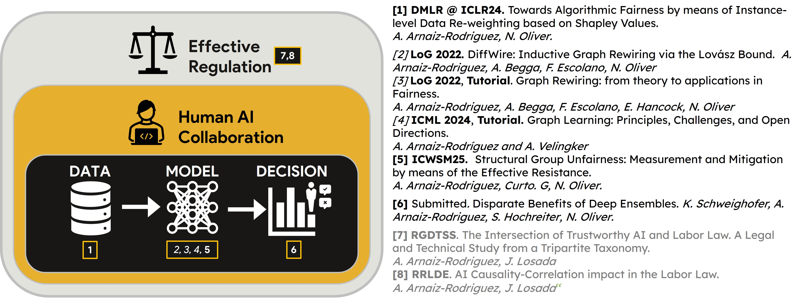

I gave a talk on ***A Holistic View of Algorithmic Fairness and Trustworthy AI: Society and Algorithms** at the [**Joint Research Center of the European Commission (JRC-EU)**](https://joint-research-centre.ec.europa.eu/jrc-sites-across-europe/jrc-seville-spain_en) and [**European Center of Algorithmic Transparency (ECAT)**](https://algorithmic-transparency.ec.europa.eu/index_en) at Seville, Spain.

The talk covered how to effectively mitigate bias in a society: I focused both in technical (*Algorithmic Fairness*) and non-technical methods (*AI Governance*):
* Methods focused on technically improve the algorithms to satisfy the societal needs: understanding algorithmic fairness and adding human relations to critical decision-making.
* Methods focused on an effective regulation of AI, how the AI Act interact with the existing regulations and how technical characteristics of AI can conflict with existing regulation.

