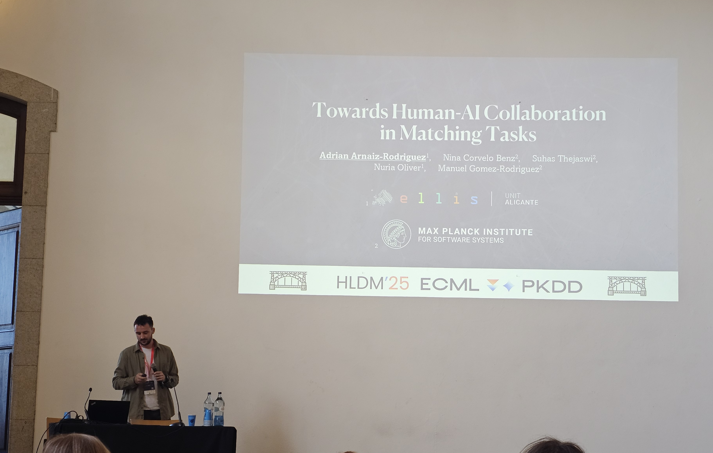

I presented the paper [*Towards Human-AI Complementarity in Matching Tasks*](https://arxiv.org/abs/2508.13285) at the **[Hybrid Human-Machine Learning and Decision Making (HLDM)](https://sml.disi.unitn.it/hldm25.html)** workshop at the [ECML-PKDD 2025](https://ecmlpkdd.org/2025/) Conference.

This paper was accepted as an ***Oral Presentation***.

