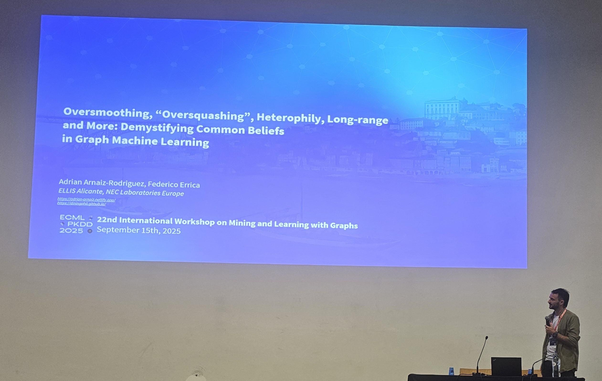

## *Best Paper Award* :trophy:  and *Best Poster Award* :trophy: at *MLG 2025*.

Federico Errica and I presented the paper [*Oversmoothing, Oversquashing, Heterophily, Long-Range, and more: Demystifying Common Beliefs in Graph Machine Learning*](https://arxiv.org/abs/2505.15547) at the **[22nd International Workshop on Mining and Learning with Graphs](https://mlg-europe.github.io/2025/)** at the [ECML-PKDD 2025](https://ecmlpkdd.org/2025/) Conference.

This paper has been accepted in this workshop as a ***Contributed Talk*** and received the **Best Paper Award** and **Best Poster Award** :trophy:.
