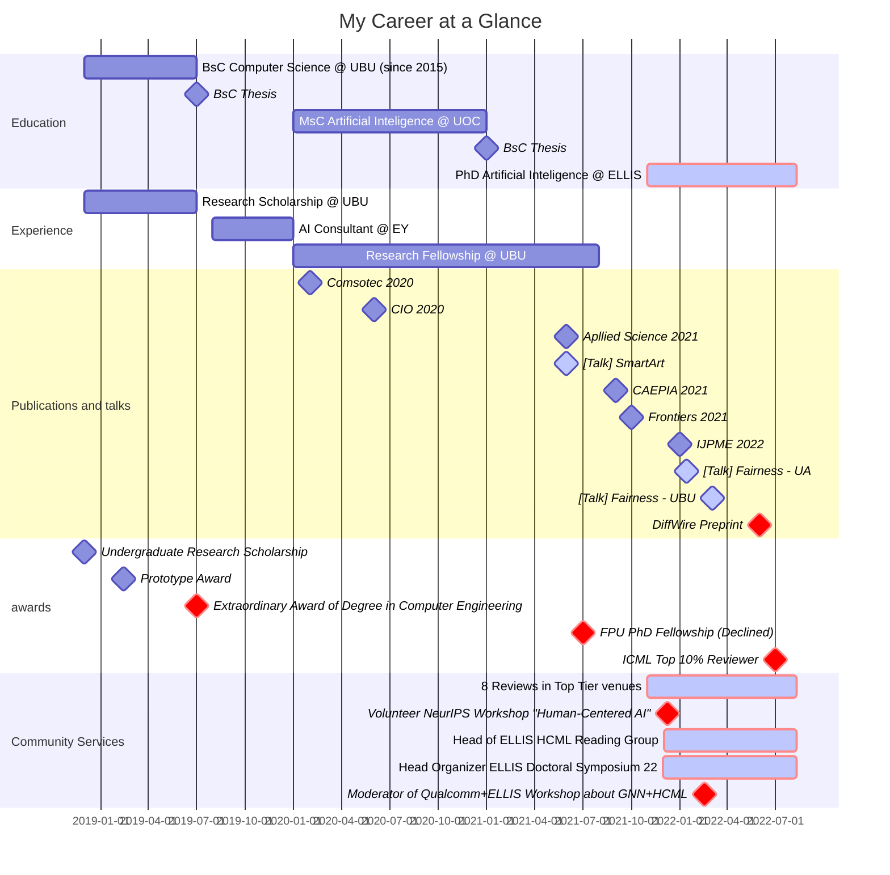

---
# An instance of the Pages widget.
# Documentation: https://wowchemy.com/docs/page-builder/
widget: blank

# This file represents a page section.
headless: true

# Order that this section appears on the page.
weight: 55

title: 'Voluntary work and Scientific Dissemination'

# Section design
design:
  # Use a 1-column layout
  columns: "1"
  # Use a dark navy background with light text.
  #background:
  #  color: '#0053D6'
  #  text_color_light: true
---

**Scientific organization**
* Head of organization of **ELLIS Doctoral Symposium 2022** - *Alicante, Sep 2022*
* Head of **ELLIS HCML Reading Group**: guest sessions and round tables - *Virtual, bi-weekly sessions*
* Moderator of **Qualcomm+ELLIS Reading Group Session about GNN+HCML** - *Online, Feb 2022*
  > Round table: Pim de Haan, Carlos Castillo, Efstatios Gavves and Manuel Gómez Rodríguez
* Volunteer at **NeurIPS Workshop "Human-Centered AI"** - *Virtual, Dec 2021*

**Open Source software**
* Open source code from BSc and MSc final projects and all published papers
* Occasional collaborator in Lightly AI PyTorch-based library for Self-Supervised Learing. Main contributor of Lightly version 1.1.2
* More open source codes in GitHub: applications, experiments and data analysis

