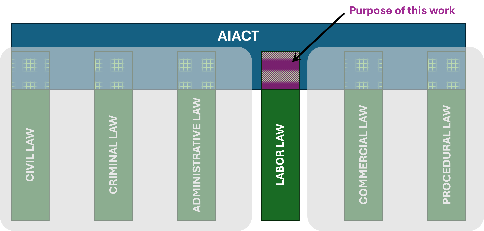

**Article written in Spanish** for the [**RGDTSS n.69**](https://www.iustel.com/v2/revistas/detalle_revista.asp?id=12&z=1): Spanish General Journal of Labor Law and Social Security (Revista General del Derecho del Trabajo y de la Seguridad Social).  This article is a legal and technical study of the intersection between Trustworthy AI and Labour Law. We propose a tripartite taxonomy to understand the implications of the AI Act in the field of Labour Law.

#### SUMMARY:
 1. Introduction and purpose of the work. 
 2. Most relevant legal milestones.
 3. Technical characteristics of sub-symbolic AI.
 4. Life cycle of an AI system: legal obligations. 
 5. Ethical principles for a Trustworthy AI: the HLEG ON AI perspective. 
 6. **Requirements of a Trustworthy  AI: intersection with labour law.**
 7. Conclusions.
  
We specifically study the implications of the AI Act and AI technical features in the field of Labour Law in Spain.  We just focus on the laboral law. 

***KEYWORDS***: Artificial Intelligence (AI), Labour Law, Labour Law, Reliable AI, AI Regulation, High-Level Expert Group on AI (HLEG), Life Cycle of AI Systems

{}
Click the *Cite* button above to show and copy bibtex reference.
{}

