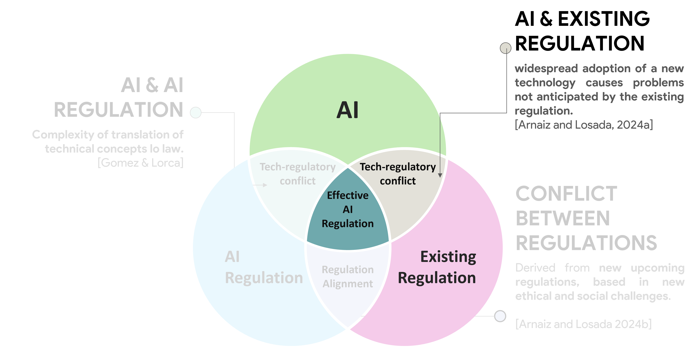

*Official WebPage of the Public Project: [Derechos Digitales en el Trabajo (Digital Rights at Work)](https://www.derechosdigitales.gob.es/es/novedades/estudio-de-la-causalidad-en-la-toma%20de-decisiones-algoritmicas-el-impacto-de-la-ia-en-el-ambito-empresarial)*

**Article written in Spanish** for the [**RRLDE vol.12 n.2**](https://ejcls.adapt.it/index.php/rlde_adapt/issue/view/105): Spanish General Journal of Labor Law and Social Security (Revista General del Derecho del Trabajo y de la Seguridad Social). AI-driven algorithmic management is reshaping workplaces but clashes with existing labor regulations, which are designed for human decision-making. AI relies on correlations, not causes, while labor laws require causal justifications for decisions. This gap can lead to legal insufficiencies and hard-to-detect discrimination. The study explores these issues and suggests possible solutions.

#### SUMMARY:
1. Introduction.
2. Brief history of AI and its evolution. 
3. Use of AI in the business field. 
   1. Advantages and risks of using AI in decision making. 
4. Concept of AI system. Legal aspects. Technical aspects.
   1. Concept of AI system. 
   2. Legal aspects of AI systems in algorithmic management.
   3. Technical aspects of AI systems in algorithmic management.
      1. Operation of AI systems in decision making.
      2. Explanation of the correlation-causation dilemma. Examples in the workplace.
      3. Blackbox. Explainability. 
5. Existence of causality in algorithmic management. 
   1. Pre-contractual phase. 
   2. Contractual phase.
6. Proposal of solutions. 
   1. 6.1. Technical solutions.
   2. Legal solutions.
7. Conclusions.
   

{}
Click the *Cite* button above to show and copy bibtex reference.
{}

