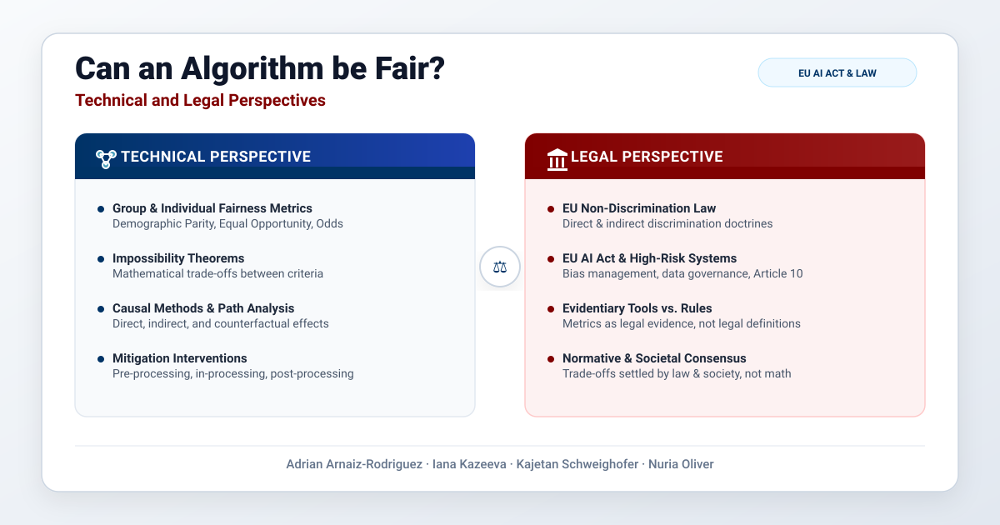

**English title:** Can an Algorithm Be Fair? Technical and Legal Perspectives.

**Article written in German**, published in *ailex*, no. 3 (2026), pp. 123-130, by MANZ.

[Read the article on the publisher's website](https://rdb.manz.at/document/rdb.tso.LIailex20260305).

**TL;DR**

We bridge algorithmic fairness and EU non-discrimination law in one paper, providing:

- Mapping causal path-specific effects onto direct and indirect discrimination, while being explicit about the limits of that analogy.
- Guidance on choosing a fairness metric based on the decision context and the harm it should capture, treating metrics as evidence rather than legal rules.
- A section on how to assess fairness in practice: sampling and statistical power for small groups, intersectional subgroups, long-term effects, and how metrics can be gamed.
- An account of why mitigation needs protected attributes, tied to positive action and the AI Act's special-category data rules, including the Digital Omnibus.
- **An up-to-date review of how EU law handles algorithmic discrimination in high-risk AI systems, general-purpose AI, and online platforms (AI Act, DSA, GDPR, Digital Omnibus, CEN-CENELEC standard), including where the gaps are**.

The takeaway: **choosing what to equalize is a societal and legal decision, not a technical one**.

<!-- The takeaway: choosing what to equalize is a societal and legal decision, not a technical one.
**What this paper adds**

- A single, accessible map of algorithmic fairness for legal readers, organized along two axes: group vs. individual, and statistical vs. causal.
- A link between causal fairness (direct and indirect effects) and the legal notions of direct and indirect discrimination, with clear limits on how far the analogy goes.
- A view of fairness metrics as evidentiary tools, not legal rules, plus practical guidance on choosing a metric based on the decision context and the harm it is meant to capture.
- A guide to assessing fairness in practice: sampling and statistical power for small groups, intersectional subgroups, long-term effects, and how metrics can be gamed (Goodhart's law, selective labels, fairwashing).
- An explanation of why fairness interventions need protected attributes, and how this connects to positive action, equality data, and the AI Act's rules on processing special-category data.
- An up-to-date review of how EU law handles algorithmic discrimination in high-risk AI systems, general-purpose AI, and online platforms (AI Act, DSA, GDPR, Digital Omnibus, CEN-CENELEC standard), including where the gaps are.
- A reminder that stereotype and representation harms in generative AI and platforms go beyond what decision-based fairness metrics can capture.
- The central message: what to equalize is a societal and legal choice, not something a technical criterion can settle on its own.

-->

{}
Click the *Cite* button above to show and copy the BibTeX reference.
{}